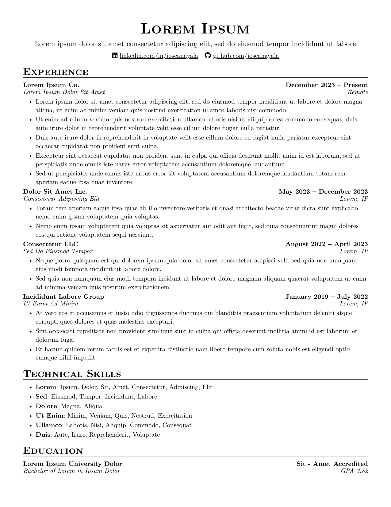

<h1 align="center"><i>resumé</i></h1>

<p align="center">
  A <a href="https://typst.app">Typst</a> port of <a href="https://github.com/sb2nov/resume">sb2nov/resume</a> — opinionated single-page layout.
  <br/>
  Fork the repo, rewrite <code>resume.typ</code>, push to <code>main</code>, get a tagged PDF release.
</p>

<p align="center">
  <a href="https://github.com/JoseanAyala/resume-template/actions/workflows/release.yml"></a>
  <a href="https://github.com/JoseanAyala/resume-template/releases/latest"></a>
  <a href="LICENSE"></a>
  
</p>

<p align="center">
  <a href="https://github.com/JoseanAyala/resume-template/releases/latest"><strong>Download the latest resume</strong></a>
</p>

<p align="center">
  <a href="https://github.com/JoseanAyala/resume-template/releases/latest"></a>
</p>

## Why

- **One file to edit.** Content lives in `resume.typ`. Everything else is the template.
- **Single-page, opinionated.** The sb2nov layout — clean headings, tight spacing, icon-prefixed contact line.
- **Push to publish.** Every commit to `main` cuts a tagged GitHub Release with the PDF attached.
- **Regression-checked.** `make test` diffs your build against the last release by word-multiset and pixels.
- **Modern toolchain.** Typst compiles in milliseconds; no LaTeX, no Docker, no `\usepackage` archaeology.

## Quick start

```sh
make install   # one-time: brew install gh typst typstyle diff-pdf poppler
make           # build output/resume.pdf
make watch     # live-rebuild on save
make test      # diff against the latest GitHub Release (override with REF_TAG=v...)
```

## Layout

```
resume.typ           # content — the only file you edit to make it yours
lib.typ              # public entry: `#import "lib.typ": *` re-exports everything below
lib/
  tokens.typ         # design tokens: spacing scale, type sizes, layout, fonts
  icons.typ          # Font Awesome glyphs as named refs (icons.phone, icons.github)
  components.typ     # header, entry, bullets, skills
fonts/               # font path passed to typst via --font-path (empty in repo; CI fetches FA)
```

## CI

Every push to `main` triggers [`.github/workflows/release.yml`](.github/workflows/release.yml):

1. Restore Font Awesome from cache (download + unzip on first run)
2. Build the PDF with `make build`
3. Compute tag `v<UTC-date>-<sha>` and stamp it into the filename
4. Publish a GitHub Release with `resume-<tag>.pdf` attached

Grab the latest from the [releases page](https://github.com/JoseanAyala/resume-template/releases/latest).

## License

MIT — see [LICENSE](LICENSE). Fork it, change the content, ship it.
